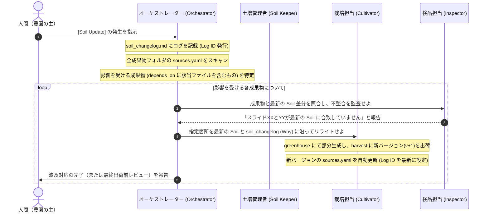

# 層間プロトコル・ルール (Layer Protocol Rules)

> 支柱 (trellis)：ファームの各層（ディレクトリ）を統治する自律分散エージェント（Domain Agents）が、互いに密結合せず、かつ確実に情報の変更（伝播）を検知・処理するための通信規格（プロトコル）を定義します。

---

## 1. なぜ「中央台帳 (`source_map.yaml`)」を作らないのか？

従来の設計では、ファーム全体で1つの `source_map.yaml` を持ち、「どのSoilがどの成果物に使われているか」を一元管理することを想定していました。しかし、実務上この設計は以下の理由から**アンチパターン**であることが判明しました：

1. **二重管理の発生**: 人間またはAIが成果物を更新する際、成果物自体と中央台帳の両方を二重に更新せねばならず、書き漏れが発生しやすい。
2. **情報の腐敗と不整合**: 成果物を削除・リネームした際に中央台帳の記述だけが取り残され、台帳が「実態と乖離したゴミ箱」化する。
3. **コンテキストの浪費**: 巨大化した `source_map.yaml` を毎度AIが全スキャンすることは、トークン長と精度の観点から極めて非効率である。

### 解決策：自律分散プロトコル
本プロトコルでは、中央台帳を一切廃止します。代わりに：
- 各成果物自身が自身の依存する土壌を自己申告する **`sources.yaml`** を持つ。
- 土壌の変更は、履歴ログである **`90_weather/soil_changelog.md`** に時系列で記録する。
- 変更の波及（伝播）は、オーケストレーターが上記2つを照合することによって**オンデマンドで影響範囲を追跡**する。

---

## 2. 成果物の自己申告仕様 (`sources.yaml`)

AIが成果物を生成（`60_harvest/` への出力）または出荷（`80_market/` への配置）する際、その成果物ディレクトリの直下に必ず `sources.yaml` を配置しなければなりません。

### 配置場所の例：
- `60_harvest/sales_deck/v001/sources.yaml`
- `80_market/sales_deck/2026-05-20_client_a/sources.yaml`

### `sources.yaml` の記述フォーマット：
```yaml
# sources.yaml
# この成果物バージョンが依存している土壌および、変更の取り込み状態を自己申告するファイル。

# 1. 依存している正規情報（Soil）および素材（Seedbank）の絶対パスまたは相対パス
depends_on:
  - 00_soil/business/commercial_offer.md
  - 00_soil/product/feature_catalog.yaml
  - 20_seedbank/common_diagrams/system_architecture.png

# 2. この成果物が「いつ時点の Soil 変更ログまで取り込み済みか」のIDまたは日付
# （90_weather/soil_changelog.md の log_id と一致させる）
generated_from_soil_changelog_until: LOG-2026-05-19-01

# 3. 変更ログには存在するが、あえて「まだ反映していない」または「意図的に反映しない」土壌変更がある場合
# （例: 一時的に古いプライシングを適用したい等の例外処理時）
not_yet_reflected: []
# 例：
# not_yet_reflected:
#   - log_id: LOG-2026-05-20-02
#     reason: "クライアントAとの事前合意に基づき、旧PoC条件(1ヶ月)を維持するため"
```

---

## 3. 土壌変更ログ仕様 (`90_weather/soil_changelog.md`)

土壌（`00_soil/`）の情報が追加、更新、削除された場合、土壌管理者（Soil Keeper）またはオーケストレーターは、その出来事を必ず `90_weather/soil_changelog.md` に追記しなければなりません。

### ログの記述フォーマット（Markdown テーブル）：
各行には、変更された「事実」だけでなく、**「変更された背景・意図（Why）」を記述することを義務付けます**。Whyが欠落していると、成果物を更新する際にAIがどのようなトーンや方向性でリライトすべきか判断できず、不適切な成果物を生成する原因になります。

```markdown
| 日付 (Date) | ログID (Log ID) | 対象ファイル (Affected File) | 変更概要 (Summary) | 変更の理由・意図 (Why/Intent) |
| :--- | :--- | :--- | :--- | :--- |
| 2026-05-19 | LOG-2026-05-19-01 | `00_soil/business/commercial_offer.md` | PoC期間を2ヶ月から3ヶ月に延長 | トライアルでの定着率向上のため、十分な検証期間を顧客に提供する方針決定に基づく。 |
```

---

## 4. [Soil Update] イベントの自律波及フロー

土壌が更新されたイベント（[Soil Update]）を検知した際、オーケストレーターおよび各分散エージェントは以下のステップで動作し、成果物へ変更を伝播させます。



### 例外的な selective update（部分反映）の扱い
人間が「この成果物だけは古い設定のままにしておいてほしい」と明示的に指示した場合は、生成プロセスの自動伝播を停止させ、その成果物の `sources.yaml` 内の `not_yet_reflected` セクションに未反映の Log ID と理由（Reason）を書き込むことで、以降の自動伝播アラートの対象外とします。
