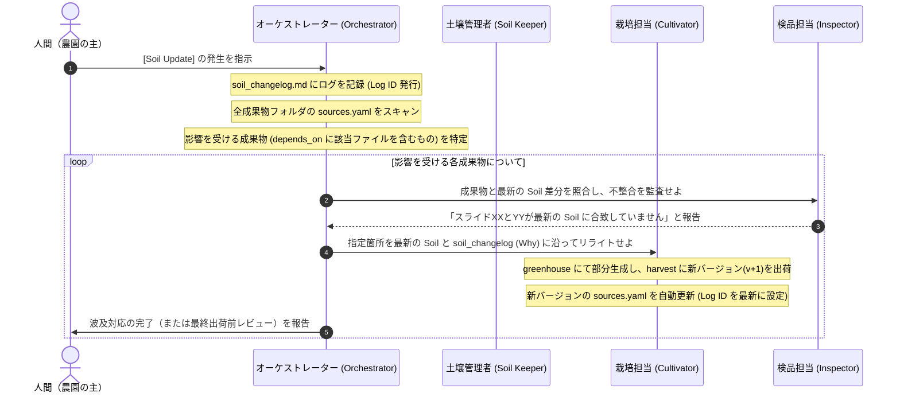

# 層間プロトコル・ルール (Layer Protocol Rules)

> 支柱 (trellis)：ファームの各層（ディレクトリ）を統治する自律分散エージェント（Domain Agents）が、互いに密結合せず、かつ確実に情報の変更（伝播）を検知・処理するための通信規格（プロトコル）を定義します。

---

## 1. なぜ「中央台帳 (`source_map.yaml`)」を作らないのか？

従来の設計では、ファーム全体で1つの `source_map.yaml` を持ち、「どのSoilがどの成果物に使われているか」を一元管理することを想定していました。しかし、実務上この設計は以下の理由から**アンチパターン**であることが判明しました：

1. **二重管理の発生**: 人間またはAIが成果物を更新する際、成果物自体と中央台帳の両方を二重に更新せねばならず、書き漏れが発生しやすい。
2. **情報の腐敗と不整合**: 成果物を削除・リネームした際に中央台帳の記述だけが取り残され、台帳が「実態と乖離したゴミ箱」化する。
3. **コンテキストの浪費**: 巨大化した `source_map.yaml` を毎度AIが全スキャンすることは、トークン長と精度の観点から極めて非効率である。

### 解決策：自律分散プロトコル
本プロトコルでは、中央台帳を一切廃止します。代わりに：
- 各成果物自身が自身の依存する土壌を自己申告する **`sources.yaml`** を持つ。
- 土壌の変更は、履歴ログである **`90_weather/soil_changelog.md`** に時系列で記録する。
- 変更の波及（伝播）は、オーケストレーターが上記2つを照合することによって**オンデマンドで影響範囲を追跡**する。

---

## 2. 成果物の自己申告仕様 (`sources.yaml`)

AIが成果物を生成（`60_harvest/` への出力）または出荷（`80_market/` への配置）する際、その成果物ディレクトリの直下に必ず `sources.yaml` を配置しなければなりません。

### 配置場所の例：
- `60_harvest/sales_deck/v001/sources.yaml`
- `80_market/sales_deck/2026-05-20_client_a/sources.yaml`

### `sources.yaml` の記述フォーマット：
```yaml
# sources.yaml
# この成果物バージョンが依存している土壌および、変更の取り込み状態を自己申告するファイル。

# 1. 依存している正規情報（Soil）および素材（Seedbank）の絶対パスまたは相対パス
depends_on:
  - 00_soil/business/commercial_offer.md
  - 00_soil/product/feature_catalog.yaml
  - 20_seedbank/common_diagrams/system_architecture.png

# 2. この成果物が「いつ時点の Soil 変更ログまで取り込み済みか」のIDまたは日付
# （90_weather/soil_changelog.md の log_id と一致させる）
generated_from_soil_changelog_until: LOG-2026-05-19-01

# 3. 変更ログには存在するが、あえて「まだ反映していない」または「意図的に反映しない」土壌変更がある場合
# （例: 一時的に古いプライシングを適用したい等の例外処理時）
not_yet_reflected: []
# 例：
# not_yet_reflected:
#   - log_id: LOG-2026-05-20-02
#     reason: "クライアントAとの事前合意に基づき、旧PoC条件(1ヶ月)を維持するため"
```

---

## 3. 土壌変更ログ仕様 (`90_weather/soil_changelog.md`)

土壌（`00_soil/`）の情報が追加、更新、削除された場合、土壌管理者（Soil Keeper）またはオーケストレーターは、その出来事を必ず `90_weather/soil_changelog.md` に追記しなければなりません。

### ログの記述フォーマット（Markdown テーブル）：
各行には、変更された「事実」だけでなく、**「変更された背景・意図（Why）」を記述することを義務付けます**。Whyが欠落していると、成果物を更新する際にAIがどのようなトーンや方向性でリライトすべきか判断できず、不適切な成果物を生成する原因になります。

```markdown
| 日付 (Date) | ログID (Log ID) | 対象ファイル (Affected File) | 変更概要 (Summary) | 変更の理由・意図 (Why/Intent) |
| :--- | :--- | :--- | :--- | :--- |
| 2026-05-19 | LOG-2026-05-19-01 | `00_soil/business/commercial_offer.md` | PoC期間を2ヶ月から3ヶ月に延長 | トライアルでの定着率向上のため、十分な検証期間を顧客に提供する方針決定に基づく。 |
```

---

## 4. [Soil Update] イベントの自律波及フロー

土壌が更新されたイベント（[Soil Update]）を検知した際、オーケストレーターおよび各分散エージェントは以下のステップで動作し、成果物へ変更を伝播させます。



### 例外的な selective update（部分反映）の扱い
人間が「この成果物だけは古い設定のままにしておいてほしい」と明示的に指示した場合は、生成プロセスの自動伝播を停止させ、その成果物の `sources.yaml` 内の `not_yet_reflected` セクションに未反映の Log ID と理由（Reason）を書き込むことで、以降の自動伝播アラートの対象外とします。

---

## 5. 参照モード分離（Exact vs Canonical Latest Reference）

成果物間の参照には性質の異なる 2 種類が混在しており、Farm Core はこれらを**明示的に分離**します。両者を混ぜると、版上げのたびに大量のパス書き換えが発生し、参照と実体が乖離する原因になります。

### 5.1 二つの参照モード

| モード | 用途 | 書き方 |
| :--- | :--- | :--- |
| **exact reference**（固定版参照） | 再現性・監査性が必要 | 版付きパスを直接書く（例: `60_harvest/business_plan_investor/v004/...`） |
| **canonical latest reference**（最新版参照） | 「そのartifactの現在の正本」を指したいだけ | `60_harvest/<artifact>/current.yaml` 経由で参照する |

### 5.2 どちらを使うべきか

**exact reference を使うべき箇所**（再現性が要件）：

- `sources.yaml` の `depends_on`
- `80_market/<artifact>/<date>_<slug>/artifact_manifest.yaml`
- `80_market/` 配下の出荷スナップショット内部の参照
- `90_weather/decision_log.md`、監査記録、外部反応ログ
- 「v003 を投資家 A に出したスナップショット」のように歴史的事実として固定したい記述

**canonical latest reference を使うべき箇所**（最新版追従でよい）：

- `40_trellis/prompts/generate_<artifact>.md`、`review_<artifact>.md`
- `50_greenhouse/<artifact>/context_pack.md`、`deck_brief.md`
- artifact 間の通常参照（別 artifact からの引用：「最新の business_plan の市場章を参照」など）
- AI 作業ログ内の「最新版を見ろ」レベルの参照
- README / 案内ドキュメント

### 5.3 current pointer ファイル

各 artifact ディレクトリ直下に `current.yaml` を配置します。雛形は `40_trellis/templates/artifact_common/current.yaml` を参照。

```yaml
# 60_harvest/<artifact>/current.yaml
artifact: business_plan_investor
current_version: v004
primary_file: 60_harvest/business_plan_investor/v004/business_plan.md
```

canonical latest reference を必要とする側は、このファイルを介して最新版を解決します。

### 5.4 版昇格時の必須チェック

新版を `60_harvest/<artifact>/v00X/` に昇格させたら、以下を必ず実行します（詳細は `40_trellis/rules/artifact_rules.md` §11）：

1. `60_harvest/<artifact>/current.yaml` の `current_version` と `primary_file` を新版に更新する
2. 新版ディレクトリ内の `sources.yaml` の `version:` フィールドと実ディレクトリ名の整合を確認する
3. 「canonical latest reference を使うべきファイル」に古い版付きパスが残っていないかを監査する
   （grep ベースで旧版番号を機械的に検出可能）
4. 旧版が exact reference として参照されているか（つまり「v003 として明示的に固定したい」記述か）を確認する

### 5.5 将来拡張

`current.yaml` の更新自動化、および新版昇格時に「最新版追従で良い記述だけ機械的に書き換える」検査ルールは、運用が安定し次第 Farm Core に取り込む。

---

## 6. OKF (Open Knowledge Format) 仕様と適用

Farmでは、AIによる高精度な知識検索（セマンティック検索・RAG）と正規情報の厳密なライフサイクル管理を実現するため、`00_soil/`（正規情報）配下のドキュメントに **OKF (Open Knowledge Format)** を適用します。

### 6.1 OKFの適用基準 (Promotion Criteria)
- **`00_soil/`（正規情報）配下**: **必須**。全てのMarkdownファイルは、冒頭にYAMLフロントマター（メタデータ）を持たなければなりません。
- **`10_seeds/`（未整理素材）配下**: **非適用**。人間が手軽に入力できるよう、OKFは適用しません。
- **`20_seedbank/`（再利用アセット）配下**: **任意**。再利用性が高く、メタデータでの検索性が必要なものに適用します。
- **`80_market/`（出荷版）配下**: **任意**。ファイル自体への埋め込み、または `artifact_manifest.yaml` による代替が可能です。

> **💡 AIによる自動適用ルール**
> 人間が素材（Seed）から `00_soil/` への情報昇格を行う際、AI（Soil Keeper）は自動的に `40_trellis/templates/okf_soil_template.md` をベースにOKFフォーマットを構築・適用しなければなりません。

### 6.2 YAMLフロントマターの構成スキーマ
OKFファイルは、以下のYAMLフロントマターを先頭に必ず記述します。

```yaml
---
type: "カテゴリ（例: business_model, product_spec, brand_guideline, market_hypothesis, claim_registry）"
title: "ドキュメントタイトル"
description: "概要の簡潔な要約（1-2文）"
status: "状態。canonical（正規有効）または deprecated（廃止）"
timestamp: "作成または最後の検証日時 (ISO 8601形式)"
owner: "情報の管理責任者または役割"
freshness_sla: "見直し周期。monthly / quarterly / yearly / adhoc"
depends_on_seeds: [] # 昇格元のSeedパスやID
tags: [] # 検索タグ
---
```

### 6.3 OKFを活用したAI自律検索プロトコル (Search & Retrieval)
AIエージェント（特に Orchestrator と Cultivator）は、プロジェクト内の情報を探索・参照する際、OKFの特性を活かして以下のように検索・パースを最適化しなければなりません。

1. **メタデータフィルタリング (Metadata Filtering)**
   - 情報を探す際、まず全ドキュメントのYAMLフロントマターをスキャンまたはインデックスし、`type` や `tags` に基づいて対象ドキュメントを絞り込みます。
   - `status: canonical` のみを最新の真実として扱い、`deprecated` のファイルは「過去の履歴」として分離し、明示的指示がない限り生成処理には使用しません。
2. **情報の「新鮮度（Freshness）」監査**
   - 参照するSoilファイルの `timestamp` と `freshness_sla` を確認し、SLA期限が切れている（例: `monthly` なのに最終更新が2ヶ月前）場合は、人間への回答または作業ログに「この情報は最終更新から一定期間経過しています」とアラートを添えて提示します。
3. **芋づる式（Traversal）コンテキスト探索**
   - 単なるキーワード一致検索だけでなく、OKFドキュメント内の「## 関連コンセプト」セクションや本文内のMarkdownリンク（例: `[仕様](../../00_soil/product/spec.md)`) を辿り、関連する周辺知識をグラフ状に芋づる式に取得（Traversal Retrieval）します。これにより、断片的な情報だけでなく、一貫した文脈を伴った生成が可能になります。

---

## 7. LLM Wikiパターンの統合プロトコル (LLM Wiki Integration)

Farmは、ナレッジベースの自律的な「蓄積・保守・クリーンアップ」を実現するため、Andrej Karpathy氏が提唱する「LLM Wiki」パターンの運用品質管理を取り入れます。

### 7.1 Soil Indexの自動更新ルール (Soil Index Maintenance)
`00_soil/` のルートには、全情報を俯瞰する [soil_index.md](../../00_soil/soil_index.md) を配置します。
- **更新契機**: 情報が `00_soil/` に昇格（新規作成）、更新、または `status: deprecated` （廃止）に変更されたタイミング。
- **更新内容**: 土壌管理者（Soil Keeper）は、変更されたファイルの `type`, `title`, `description`, `owner`, `tags` を読み取り、[soil_index.md](../../00_soil/soil_index.md) 内の該当カテゴリのテーブル行を追加・更新・削除しなければなりません。
- **検索の起点**: オーケストレーターは複雑な質問や関連性の低い質問を受けた際、最初に `soil_index.md` をロードして全体構造を把握した上で、どのドキュメントを読み込むかを決定します。

### 7.2 Lint（定期検診）プロトコル
AIは定期的なメンテナンス時、または人間から `[Lint]` 指示を受けた際、以下の項目を網羅的に検査し、不具合があれば `90_weather/decision_log.md` または回答ログに「改善提案」として報告しなければなりません。

1. **矛盾チェック (Contradiction Check)**
   - 関連するドキュメント同士（特に同じカテゴリやタグを持つもの）を比較し、内容、数値（価格、仕様）、PoC期間などの主張に「不整合や衝突」がないかを検証する。
2. **リンク切れ・孤立チェック (Orphans & Broken Links)**
   - OKFフロントマターの「## 関連コンセプト」または本文リンクが正常に存在する相対パスを指しているかをチェックし、リンク切れを検出する。
   - 他のどのドキュメントからもリンクされていない「孤立したSoil（Orphan Page）」を検出する。
3. **鮮度とSLA切れチェック (Stale Claim Check)**
   - `freshness_sla` に従い、見直し期限（timestampから起算）を超過しているファイルをリストアップする。
4. **データのギャップチェック (Data Gaps)**
   - `common_objections.md` 等で言及されているが、具体的な製品仕様（Soil）に定義が存在しないような情報の不足を検知する。

### 7.3 Query（対話・探索）の永続化ルール (Query Compounding)
ユーザーとのやり取り（チャットや質問）を通じて生まれた、有益な情報、比較分析、構成案、または顧客からの洞察は、使い捨てにせずナレッジベースへフィードバック（永続化）します。
- **永続化基準**: 
  - ユーザーが「なるほど」「これは後で使える」「これを記録しておいて」と明示した会話。
  - AIが対話内で生成した「比較表」「競合分析」「新プランの構成」など、今後の生成物に再利用できる知的資産。
- **保存手順**:
  - 気象観測員（Weather Observer）または播種エージェント（Seed Agent）は、該当の対話ログと分析結果をMarkdownに整理し、`20_seedbank/conversations/` または `10_seeds/inbox/` にアセットとして保存します。
  - 必要に応じて、土壌管理者（Soil Keeper）がこれを `00_soil/` へ昇格させる提案を行います。これにより、チャット経由の学習成果がFarmの土壌へ還元され、永続的に蓄積されます。
